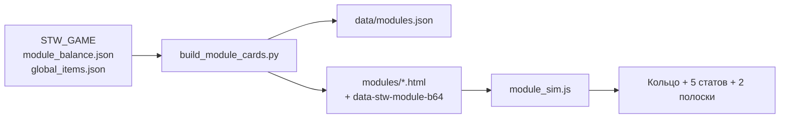
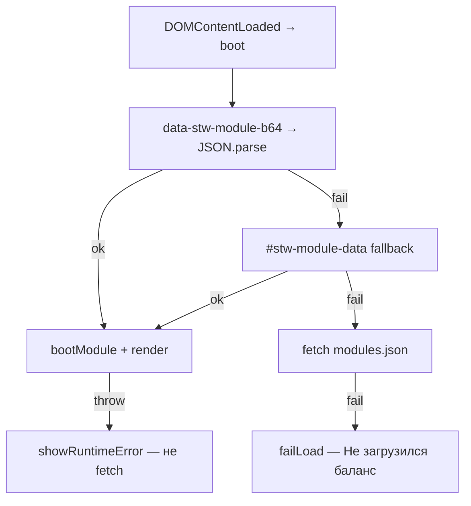

# Карточки модулей и симулятор — итог доработки и инструкция для агентов

Документ фиксирует работу по интерактивным карточкам **14 модулей брони** в репозитории [visual-cards](https://github.com/NikitaKozemyaka/visual-cards) (GitHub Pages: https://nikitakozemyaka.github.io/visual-cards/).  
Источник баланса — **STW_GAME**: `data/module_balance.json`, `global_items.json`, `data/arena_shop_catalog.json`.

Эталон UI симулятора: [cardify stasis-anchor](https://cardify-indol.vercel.app/modules/stasis-anchor).

---

## 1. Что получилось в итоге

### Продукт

- **14 HTML-страниц** в `modules/` — по одной на каждый модуль из баланса игры.
- **Каталог** `modules/index.html` — сетка карточек с обложками, emoji, редкостью.
- **Интерактивный симулятор** на каждой странице:
  - уровень L1–L9;
  - тумблер «Экипировать»;
  - тумблер команды (`/pin`, `/stabilize`, …) — **по умолчанию выкл**;
  - SVG-кольцо (hero) + **5 карточек статов + 2 полоски** (layout как в cardify);
  - для **Стазис-якоря** — доп. блок «Уклонение врага» (10/20/35/50% + слайдер 0–60%).
- **Офлайн-загрузка баланса** — JSON встроен в страницу (base64), fetch `modules.json` только fallback.
- **Кеш-бusting** — `module_sim.js?v=8` (номер версии поднимать при каждом изменении JS).

### Технический стек

| Слой | Файлы |
|------|--------|
| Данные | `data/modules.json` (генерируется из STW_GAME) |
| Генератор HTML | `scripts/build_module_cards.py` |
| Симулятор (runtime) | `modules/module_sim.js` |
| Стили | `assets/site-motion.css`, `rarity.css`, `compact.css`, `touch-safe.css`, `catalog.css` |
| Тесты | `scripts/test_module_sim_embed.py`, `scripts/audit_module_sim_wiring.py` |

---

## 2. Архитектура: от баланса игры до цифр на экране



### Контракт DOM (обязателен на каждой странице модуля)

Генератор **не менять вручную** в 14 HTML — только через `build_module_cards.py`.

| Атрибут / id | Назначение |
|--------------|------------|
| `section[data-module-id]` | id модуля, напр. `tactical_stasis_anchor` |
| `section[data-stw-module-b64]` | base64(JSON модуля) — primary источник данных |
| `#stw-module-data` | `<script type="application/json">` — fallback |
| `#sim-equip`, `#sim-cmd` | тумблеры экипировки и команды |
| `[aria-label="Уровень модуля"]` | кнопки L1–L9 |
| `[data-hero-ring]`, `[data-hero-value]`, `[data-hero-label]` | SVG-кольцо и hero |
| `[data-stats-grid]` | сетка 5 карточек |
| `[data-bars]` | 2 полоски Пасс / команда |
| `[data-sim-extra="dodge"]` | **только** `sim_kind: stasis_anchor` |

### Загрузка данных в `boot()`



**Критично:** parse и start **разделены**. Runtime-ошибка в `render()` / `calc*` **не** должна уводить в fetch (иначе ложное «Не загрузился баланс» и пустая сетка статов).

### Маршрутизация формул

```javascript
if (mod.sim_kind === "stasis_anchor") {
  calcStasis(mod, level, dodge, equipped, cmdOn);
} else {
  calcGeneric(mod, level, equipped, cmdOn);
}
```

Общий каркас отображения — `pack()`: 5 rows + 2 bars. Стазис — отдельные формулы в `calcStasis()` (шанс попадания, dodge, раунды `/pin`).

---

## 3. Хронология доработок (этот чат и смежные коммиты)

| Коммит | Суть |
|--------|------|
| `a975226` | 14 интерактивных карточек модулей |
| `0337e23` | Единое SVG-кольцо, статы стазиса, усиленный tap каталога |
| `d996ccf` | Embed JSON в HTML; live-dot по редкости в CSS |
| `680e490` | Кольцо и формулы = пассив + команда |
| `74b1487` | Layout всех модулей как cardify: `pack()`, 5+2, cmd ON (временно) |
| `3423681` | **fix_sim_boot_stats:** b64 на section, разделение parse/start, cmd **off** по умолчанию, `?v=7` |
| `dbf1eb3` | **SVG className:** `setAttribute("class")` для кольца, `?v=8` |

---

## 4. Ошибки, симптомы и решения

### 4.1 «Не загрузился баланс» + «!» в hero, пусто под кольцом

**Симптом:** hero `!`, подпись «Не загрузился баланс», `data-stats-grid` пуст.

**Причина (класс бага):** в старом `boot()` любая runtime-ошибка внутри `start(JSON.parse(...))` попадала в `catch` как «parse failed» → повтор через `fetch modules.json` → в Telegram WebView fetch часто блокируется → `fail()`.

**Дополнительно:**
- embed только в `<script type="application/json">` — хрупко в WebView;
- при `fail()` `renderStats` / `renderBars` не вызывались.

**Решение:**
1. Primary: `data-stw-module-b64` на `<section>` (UTF-8 JSON → base64).
2. `parseModuleData(root)` — b64 → script → fetch.
3. `try { start(mod) } catch { showRuntimeError }` — **без** fallback fetch при runtime.
4. `failLoad()` только если данные реально не прочитаны.

### 4.2 Пустой блок статов при «живом» симуляторе

**Симптом:** тумблеры работают, L3 подсвечен, но нет карточек Пассив / команда / полосок.

**Причина:** та же цепочка, что в 4.1 — render не доходил до конца.

**Решение:** п. 4.1 + явный `showUiError` если нет `#sim-equip` / `#sim-cmd` / level group; `render()` в try/catch.

### 4.3 Команда включена по умолчанию (не по продукту)

**Симптом:** при первом открытии `/pin активна`, кольцо как при cmd on.

**Причина:** `state.cmdOn: true` в JS и `switch_html(..., True)` в генераторе.

**Решение:**
- `state.cmdOn: false`;
- re-equip **не** включает команду (`else state.cmdOn = true` убран);
- генератор: «выкл», `aria-checked="false"`.

**Эталон стазиса L3, dodge 20, cmd off:** кольцо ~**83%**, `/pin` и раунды = `—`, сумма = только пассив (−3%).

### 4.4 «Ошибка расчёта» на всех модулях (после fix boot)

**Симптом:** hero остаётся «— / Главный эффект», в stats одна карточка «Ошибка расчёта».  
Пример: [survival_vital_weave](https://nikitakozemyaka.github.io/visual-cards/modules/survival_vital_weave.html).

**Причина:** в `applyRing()` присваивание `heroRing.className = ...` на SVG `<circle>`. В WebView/Chromium у SVGElement `className` — **read-only** (SVGAnimatedString).

**Текст ошибки:**
```text
Cannot set property className of #<SVGElement> which has only a getter
```

**Решение:**
```javascript
heroRing.setAttribute("class", "transition-[stroke-dashoffset] ...");
```
Не использовать `.className` на SVG-элементах; для HTML (кнопки, span) — можно как раньше.

**Диагностика:** headless Edge:
```powershell
& "${env:ProgramFiles(x86)}\Microsoft\Edge\Application\msedge.exe" `
  --headless --disable-gpu --virtual-time-budget=3000 `
  --dump-dom "file:///D:/visual-cards/modules/survival_vital_weave.html"
```
Искать в DOM `data-hero-value` и текст «Ошибка».

### 4.5 Кеш GitHub Pages / Telegram WebView

**Симптом:** после push старый UI (cmd on, нет b64, старый JS).

**Решение:**
- поднимать `module_sim.js?v=N` в `build_module_cards.py` и **пересобирать все HTML**;
- давать игрокам ссылки с `?v=N`;
- CDN Pages обновляется 5–10 минут (`Last-Modified` смотреть через `curl -sI`).

### 4.6 Моргающий зелёный live-dot у всех редкостей

**Симптом:** одинаковый зелёный индикатор у common и legendary.

**Решение (ранний этап):** `assets/site-motion.css` — цвет `.live-dot` от `.vc-rarity-{rarity}-sim` на section.

---

## 5. Карта модулей → ветки калькулятора

Порядок `if` в `calcGeneric()` **важен** — совпадает с `scripts/audit_module_sim_wiring.py`.

| id | sim_kind | Ветка / калькулятор |
|----|----------|---------------------|
| survival_vital_weave | generic | `heal_pct_base` |
| survival_detox_lattice | generic | `purge_pct_base` |
| combat_crit_matrix | generic | `crit_chance_base` |
| combat_kinetic_driver | generic | `damage_mult_base` |
| economy_relic_hunter | generic | `rarity_tier_boost` |
| economy_salvage_link | generic | `passive_only_slash` (пустой `command.effect`) |
| mobility_vector_thruster | generic | `uses_equals_level` |
| mobility_load_anchor | generic | `weight_reduction_base` |
| defense_guard_bastion | generic | `damage_reduction_base` |
| defense_aegis_mesh | generic | `shield_regen_mult_base` |
| tactical_recon_lens | generic | `analysis_cap` |
| **tactical_stasis_anchor** | **stasis_anchor** | **`calcStasis()`** |
| tactical_entangle_node | generic | `entangle_bonus_base` |
| tactical_stasis_tuner | generic | `uses_per_two_levels` |

При экипировке: **5 карточек + 2 полоски**. Без модуля: 5 карточек «—», полоски скрыты.

---

## 6. Инструкция для агентов: новая карточка модуля

### 6.1 Предусловия

1. Модуль уже есть в **STW_GAME**: `module_balance.json` (passive + command), `global_items.json` (type `module`).
2. Рабочая копия **visual-cards** на диске (у генератора путь `STW = Path(r"D:\STW_GAME")` в `build_module_cards.py` — при другом расположении поправить).
3. Обложка (опционально): `assets/covers/{module_id}.png`.

### 6.2 Если модуль попадает в существующую семью эффектов

Пример: новый модуль с `heal_pct_base` в `command.effect` — **достаточно пересборки**, новая ветка в JS не нужна.

**Шаги:**

```powershell
cd D:\visual-cards
python scripts/build_module_cards.py
python scripts/audit_module_sim_wiring.py
python -m unittest scripts.test_module_sim_embed -q
```

Добавить модуль в `EXPECTED_BRANCH` в `audit_module_sim_wiring.py`, если id новый.

### 6.3 Если новый тип эффекта (новая семья)

1. **`STW_GAME`** — баланс и предмет (канон игры).
2. **`modules/module_sim.js`** — новая ветка в `calcGeneric()` **до** fallback `passive_only_slash`:
   - формулы из `module_balance.json` (те же коэффициенты, что в игре);
   - возврат через `pack({ cmdOn, passN, cmdN, ringPct, heroValue, ... })`.
3. **`scripts/audit_module_sim_wiring.py`** — ключ в `BRANCH_KEYS` + строка в `EXPECTED_BRANCH`.
4. При особом UI (как dodge у стазиса):
   - `sim_kind: "новый_тип"` в `build_module_cards.py` → `build_modules()`;
   - отдельный `calc*` и ветка в `bootModule` / `render()`.
5. **Cache-bust:** увеличить `module_sim.js?v=N` в `build_module_cards.py`.
6. **Пересборка + тесты** (см. 6.2).
7. **Push** visual-cards; проверка live с `?v=N`.

### 6.4 Чеклист перед push

- [ ] `data-stw-module-b64` на section, id совпадает с JSON внутри
- [ ] `module_sim.js?v=N` одинаковый во всех 14+ HTML
- [ ] cmd по умолчанию **выкл** (генератор + JS)
- [ ] SVG-кольцо: только `setAttribute("class", ...)`, не `.className`
- [ ] L3, equipped, cmd off — hero и 5 статов не пустые, нет «Ошибка расчёта»
- [ ] audit + embed тесты зелёные
- [ ] для stasis: dodge extra только на `stasis_anchor.html`

### 6.5 Деплой

```powershell
cd D:\visual-cards
git add modules/ modules/module_sim.js scripts/ data/modules.json
git commit -m "..."
git push
```

GitHub Pages из ветки `main`. Runtime на VPS **не** трогается — только статика.

**Prod-URL:**
```text
https://nikitakozemyaka.github.io/visual-cards/modules/{filename}.html?v=N
```

`FILENAME_OVERRIDE`: только `tactical_stasis_anchor` → `stasis_anchor.html`.

---

## 7. Инструкция: правка формул / UX симулятора

| Задача | Где править |
|--------|-------------|
| Тексты howto / sources | `build_module_cards.py` → `build_howto`, `build_sources` |
| Подписи карточек, pack layout | `module_sim.js` → `pack()` |
| Формулы стазиса | `calcStasis()` |
| Формулы остальных | `calcGeneric()` — нужная ветка |
| КД команды | `cooldownSec()` ← `cooldown_base_sec`, `cooldown_per_level_sec` |
| Статический HTML симулятора | **только** через `build_module_cards.py` |

После правки JS — **обязательно** bump `?v=` и `python scripts/build_module_cards.py`.

---

## 8. Тесты

### `scripts/test_module_sim_embed.py`

- у каждого `modules/*.html` (кроме index): decode b64, `json.loads`, `id == data-module-id`;
- версия script `module_sim.js?v=N` совпадает с каноном в тесте;
- smoke формы стазиса (83% cmd off).

### `scripts/audit_module_sim_wiring.py`

- 14 модулей в каталоге и 14 HTML;
- ветка калькулятора по `EXPECTED_BRANCH`;
- DOM-контракт, slash в HTML, dodge только у stasis.

Запуск:

```powershell
cd D:\visual-cards
python scripts/audit_module_sim_wiring.py
python -m unittest scripts.test_module_sim_embed -q
```

---

## 9. Ссылки для проверки (актуальный кеш v=8)

| Страница | URL |
|----------|-----|
| Каталог | https://nikitakozemyaka.github.io/visual-cards/modules/ |
| Стазис-якорь | https://nikitakozemyaka.github.io/visual-cards/modules/stasis_anchor.html?v=8 |
| Жизненная нить | https://nikitakozemyaka.github.io/visual-cards/modules/survival_vital_weave.html?v=8 |
| Кинетический драйвер | https://nikitakozemyaka.github.io/visual-cards/modules/combat_kinetic_driver.html?v=8 |

В Telegram — **всегда с `?v=`**, иначе WebView может держать старый `module_sim.js`.

---

## 10. Что сознательно не делали

- Не меняли игровой баланс в STW_GAME ради визуалки (только читаем).
- Не возвращали оранжевый live-dot / привязку кольца к редкости (кольцо = итог формулы модуля).
- Не дублировали бизнес-логику игры в Python — симулятор в JS, тесты проверяют embed и wiring.

---

## 11. Типичные ошибки агента (anti-patterns)

1. **Править 14 HTML руками** — при следующей сборке перезатрётся; только генератор.
2. **StrReplace кириллицы в STW_GAME монолитах** — см. `AGENTS.md` STW; visual-cards обычные правки OK, но `build_module_cards.py` с русским текстом — через Write/UTF-8.
3. **Забыть bump `?v=`** — игроки видят старый баг после fix.
4. **`heroRing.className` на SVG** — снова «Ошибка расчёта» в WebView.
5. **Ловить runtime в parse catch и идти в fetch** — «Не загрузился баланс» в Telegram.
6. **Новая ветка calc без audit** — модуль молча попадёт в `passive_only_slash` с неверными цифрами.

---

*Документ составлен по итогам чата август 2026 (симулятор, boot/stats, cmd default, SVG fix). При изменении `?v=` или контракта DOM — обновить §5–§9 и константы в тестах.*
